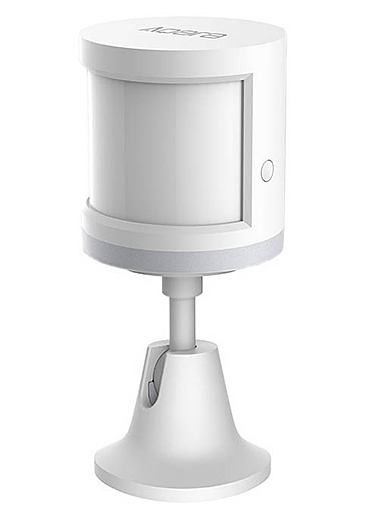

# Xiaomi Original & Aqara Device Drivers for Hubitat

Maintained by veeceeoh, adapted from bspranger/Xiaomi, a fork of a4refillpad's Xiaomi SmartThings device handler repository. 
Contributions to previous code by alecm, bspranger, foz333, gn0st1c, ronvandegraaf, tmleafs, & veeceeoh

---

## Pairing

These devices are not easy to pair initially. More information and help is available at <a href="https://community.hubitat.com/t/release-xiaomi-device-drivers/631">this Hubitat Community Forum Thread</a>.

## Currently Supported Xiaomi Devices

|||
|---|---|
|||
|**Xiaomi Temperature Humidity Sensor**|**Xiaomi Aqara Temperature Humidity Sensor**|
|||
|**Xiaomi Motion Sensor**|**Xiaomi Aqara Motion Sensor**|
|||
|**Xiaomi Door/Window Sensor**|**Xiaomi Aqara Door/Window Sensor**|
|||
|**Xiaomi Aqara Leak Sensor**||

## Device Drivers In Progress

|||
|---|---|
|||
|**Xiaomi Button**|**Xiaomi Aqara Button**|
|||
|**Xiaomi mijia Honeywell Fire Alarm Detector**||
